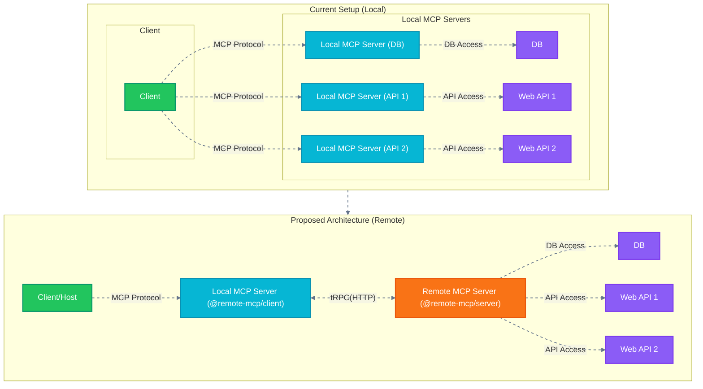

# Remote-MCP: Remote Model Context Protocol

[](https://smithery.ai/community/pack/remote-mcp)

A **type-safe, bidirectional and simple** solution for **remote MCP communication**, allowing remote access and centralized management of model contexts.


## Architecture



## Why I Made This (Now)

Yes, I know that the official MCP roadmap includes remote MCP support in the first quarter of 2025. However, the need for remote access was *immediate* for me, and likely for many others. This library was created to bridge that gap, providing a way to connect to a remote MCP server from a local MCP client *right now*, without waiting for future official implementations.

Note: I don't want this to be a sophisticated or overcomplicated thing. This way **just works right now**.

## Getting Started

> *Note: This project is currently under active development and is considered experimental. Expect breaking changes and potential issues.*

## Client Usage

### Installing via Smithery

To install Remote MCP Client for Claude Desktop automatically via [Smithery](https://smithery.ai/protocol/@remote-mcp/client):

```bash
npx @smithery/cli install @remote-mcp/client --client claude
```

### Use Publicly Published Package

Just put the following code in your MCP client settings, in here I'm using Claude as an example:

```json
{
  "mcpServers": {
    "remote-mcp": {
      "command": "npx",
      "args": ["-y", "@remote-mcp/client"],
      "env": {
        "REMOTE_MCP_URL": "http://localhost:9512",
        "HTTP_HEADER__Authorization": "Bearer <token>"
      }
    }
  }
}
```

### Code Your Own Local MCP Server

Install requirements:

```sh
$ npm install @remote-mcp/client @trpc/client@next zod
```

then write your own code like the following:

```ts
import { RemoteMCPClient } from "@remote-mcp/client";

const client = new RemoteMCPClient({
  remoteUrl: "http://localhost:9512",

  onError: (method, error) => console.error(`Error in ${method}:`, error)
});

void client.start();
```

## Server Usage (Remote MCP Implementation)

You can see some examples in the `examples` directory.

- [Cloudflare Workers](examples/cloudflare-workers)
- [Standalone Node.js](examples/simple-server)

### Code Your Own Remote MCP Server

After `npm install @remote-mcp/server`, you can your own remote MCP server like the following:

```typescript
import { MCPRouter, LogLevel } from "@remote-mcp/server";
import { createHTTPServer } from '@trpc/server/adapters/standalone';

import { z } from "zod";

// Create router instance
const mcpRouter = new MCPRouter({
  logLevel: LogLevel.DEBUG,
  name: "example-server",
  version: "1.0.0",
  capabilities: {
    logging: {},
  },
});

// Add example tool
mcpRouter.addTool(
  "calculator",
  {
    description:
      "Perform basic calculations. Add, subtract, multiply, divide. Invoke this every time you need to perform a calculation.",
    schema: z.object({
      operation: z.enum(["add", "subtract", "multiply", "divide"]),
      a: z.string(),
      b: z.string(),
    }),
  },
  async (args) => {
    const a = Number(args.a);
    const b = Number(args.b);

    let result: number;
    switch (args.operation) {
      case "add":
        result = Number(a) + b;
        break;
      case "subtract":
        result = a - b;
        break;
      case "multiply":
        result = a * b;
        break;
      case "divide":
        if (b === 0) throw new Error("Division by zero");
        result = a / b;
        break;
    }

    return {
      content: [{ type: "text", text: `${result}` }],
    };
  },
);

const appRouter = mcpRouter.createTRPCRouter();

void createHTTPServer({
  router: appRouter,
  createContext: () => ({}),
}).listen(Number(process.env.PORT || 9512));
```

Then you can see like the following in your MCP client:


## Packages

This repository contains:

*   `@remote-mcp/client`: Client library acting as a local MCP server, connecting to a remote implementation.
*   `@remote-mcp/server`: Server library for creating remotely accessible MCP services (used as the remote implementation).

## Roadmap

### Core Features

- [x] Basic *Type-safe* Client/Server Communication
  - [x] Basic MCP Command Support
  - [x] Basic MCP Tool Support
  - [x] Basic MCP Prompt Support
  - [ ] Crash-Safe Handling (WIP, top priority)
- [ ] Complete Event Subscription System
  - [ ] Resource change notifications
  - [ ] Tool/Prompt list change notifications
- [ ] HTTP Header Support
  - [x] Custom Headers
  - [ ] Authentication Middleware
- [ ] Basic error handling improvements
- [ ] Basic middleware support

### Framework Support

- [ ] Nest.js Integration (`@remote-mcp/nestjs`)

### Advanced Features

- [ ] Bidirectional communication
  - [ ] Server-to-client requests
  - [ ] Resource sharing between server/client
- [ ] Basic monitoring & logging

## Contribute

Contributions are welcome. See [CONTRIBUTING.md](CONTRIBUTING.md) for details.

## Disclaimer

This library is a complementary extension, not part of the official MCP specification, built upon existing MCP concepts.

## License

This project is licensed under the MIT License. See the [LICENSE](LICENSE) file for details.

## References

*   [Model Context Protocol](https://modelcontextprotocol.org/)
